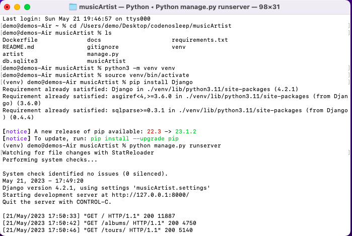
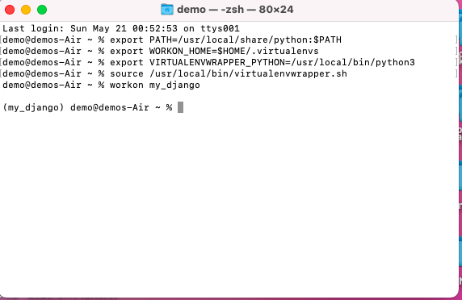

# Artist Web Application


## Description 
Django artist application is a web application built using the Django framework. It allows the admin to manage and showcase information about
the artists such as Tours and Albums.Users can register and login to the webiste.

This README.md file provides instructions on how to build and run your application on different operating systems.


## Prerequisites

Make sure you have Docker installed on your machine. Docker allows you to run the Django Artist application in a containerized environment.
If you don't have Docker installed, you can follow the official Docker documentation to install it for your operating system.


## Installation

### Cloning the Repository
1. Clone the repository to your local machine:

```
git clone https://github.com/moeketsisegalo/capstone_project_consolidation.git
```
## Running the Application
### Running with venv
### Setting Up the Virtual Environment
Before running the Django development server, make sure your virtual environment is active. If you haven't set up a virtual environment or installed Django yet, follow these steps:

1. Open a terminal or command prompt.
2. Navigate to the root directory of your project.
3. Create a new virtual environment:
```
python3 -m venv venv
```
4. Activate the virtual environment:

For macOS/Linux:
```
source venv/bin/activate
```
For windows:
```
venv\Scripts\activate
```

5. Install Django:
```
pip install Django
```

6. Start the Django development server:
```
python manage.py runserver
```




7. Access your application at http://localhost:8000/.

### Running with Docker
1. Build the Docker image:

Firs navigate to the root directory of the project 

```
docker build -t artist-app .
```


2. Run the Docker container:
```
docker run -p 8000:8000 artist-app
```


3. Access your application at http://localhost:8000/.

## Documentation

The documentation for this project can be found in the docs folder. To access it, open the index.html file in your web browser.


## Additional Information Regarding Setting Up An Environment

### Setting Up a Virtual Environment (venv)
1. Open a command prompt or terminal.
2. Navigate to the project's root directory.
3. Create a new virtual environment:
- For Windows:
  ```
  python3 -m venv venv
  ```
  ```
  venv\Scripts\activate
  ```
- For Mac/Linux:
  ```
  python3 -m venv venv
  ```
  ```
  source venv/bin/activate
  ```

### A NOTE FOR MAC USERS
In order to get your commands working, there are certain commands that need to run when opening your terminal.

### For MacOS, place the following in your ~/.zshrc(terminal):

### Setting PATH for Python 3 installed by brew if it is not present
```
export PATH=/usr/local/share/python:$PATH
```
### Configuration for virtualenv
```
export WORKON_HOME=$HOME/.virtualenvs
```
```
export VIRTUALENVWRAPPER_PYTHON=/usr/local/bin/python3
```
```
export VIRTUALENVWRAPPER_VIRTUALENV=/usr/local/bin/virtualenv
```
```
source /usr/local/bin/virtualenvwrapper.sh
```

This command will create a new virtual environment named my_django and activate it automatically.
```
mkvirtualenv my_django
```

To activate the my_django virtual environment, you can use the following command:
```
workon my_django
```


## Credits

Author: Moeketsi Segalo

## Contact

If you have any questions or suggestions, feel free to contact me:

**Your Name**
- Email: moeketsisegalo@gmail.com
- GitHub: https://github.com/moeketsisegalo


